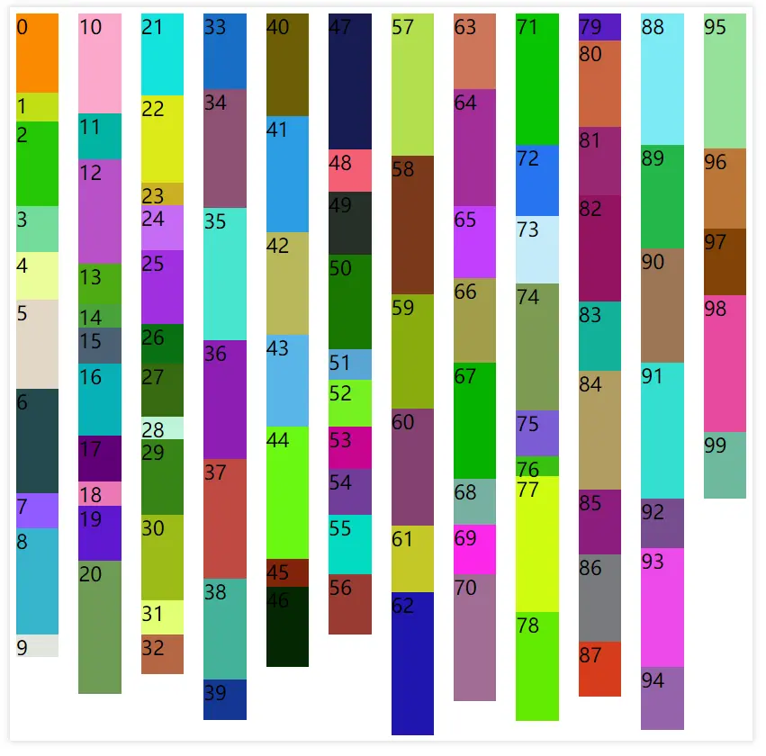
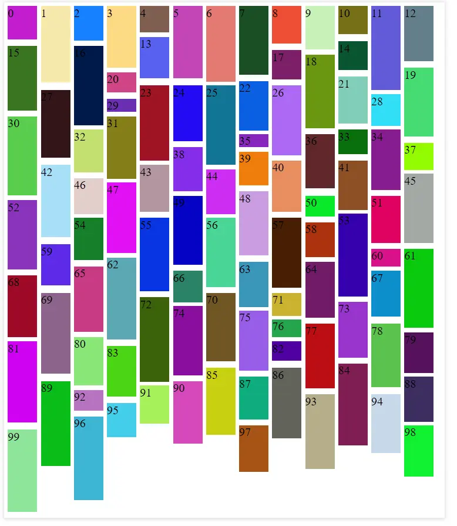

## 瀑布流布局是什么

瀑布流布局是一种常见的网页布局方式，视觉上给人一种参差不齐的多栏的效果，常用于图片为主的版块，如下图。

ok~ 现在我来试着做一做 🧐

---

## 代码实现

### 基本代码

环境 Chrome 81.0.4044.138

HTML

```html
<main></main>
```

CSS

```css
* {
  box-sizing: border-box;
}

main {
  width: 600px;
  padding: 5px;
  box-shadow: 0 0 5px 1px rgba(0, 0, 0, 0.15);
}
```

JavaScript

```javascript
// 用于生成随机颜色
const getRandomColor = () => `#${Math.random().toString(16).slice(2, 8)}`;

// 用于生成随机高度
const genRandomHeight = () => `${Math.ceil(Math.random() * 100 + 15)}px`;

const mainEl = document.querySelector("main");
// 生成100个div，方便查看效果
mainEl.innerHTML = Array.from({ length: 100 }, (x, i) => {
  return `
    <div class="item" style="background: ${getRandomColor()}; height: ${genRandomHeight()}">
      ${i}
    </div>`;
}).join("");
```

好了，现在我得到了下面的画面，看起来也像瀑布流，参差不齐，除了没有多列 😀

### columns 实现

我们还缺少一个多列，很容易想到 css 的多列布局 columns，那么事情就简单起来了。

在 css 文件，main 元素里加上一句

```css
main {
  // ...
  columns: 12;
}
```

emmm~ 好像很容易就实现了，不过等等，32、39、58、66、84、92 这几个 div 好像被腰斩了，而且元素的排序是从上往下，而不是人们熟悉的从左到右 🤔


查看 [CSS Multi-column Layout Module Level 1](https://www.w3.org/TR/css-multicol-1/) 规范后，多列布局会为子元素的内容生成 `anonymous fragmentation containers` 匿名盒子，溢出的内容会被分段，换列显示，想要控制分段，可以使用 `break-inside: avoid`（参考 [column-break-values](https://www.w3.org/TR/css-break-3/#column-break-values)）

css 文件中加入这一句

```css
// ...
break-inside: avoid;
```



考虑到浏览器对 `break-inside` 的支持不太好，可以试用

```css
.item {
  display: inline-block;
  width: 100%;
}
```


缺点就是会出现白色间隙。

### grid 实现

通过 columns 实现瀑布流布局，一大缺点是不方便改变子元素的顺序从左往右，这时可以试用 grid 来实现。

基本代码不变

```css
main {
  // ...
  // width: 600px; 去掉这个固定宽度，这里可以不使用，
  display: grid;
  // auto-fill尽可能的填充列，列的最小宽度应为40px，最大1fr，灵活的调整，让每列宽度相同
  grid-template-columns: repeat(auto-fill, minmax(40px, 1fr));
  grid-auto-rows: 40px;
  grid-gap: 5px;
}
```


现在我有了一个简单的`grid`布局，它保持了给定的顺序，并且会自动根据浏览器宽度调整列数。同时，我们也发现了几个问题，因为行高固定，所有有溢出的`div`，同时有些`div`高度不到行高，所以会有丑陋的白色间隙，当下`grid`布局是不会让子元素自动跨越行，所以要人工干预，我需要调整每一个`div`，让他们跨越不同的行数，比如 `grid-row-end: span 2;`。

这里需要使用 js 来动态设置每个 div 所跨越的行数。

```js
// 获取行高与间距，目前行高是40px，间距是5px
const rowHeight = parseInt(
  getComputedStyle(mainEl).getPropertyValue("grid-auto-rows")
);
const rowGap = parseInt(
  getComputedStyle(mainEl).getPropertyValue("grid-row-gap")
);

const setSpan = el => {
  // 计算div需要跨越的行数
  el.style.gridRowEnd = `span ${Math.ceil(
    (el.clientHeight + rowGap) / (rowHeight + rowGap)
  )}`;
};

document.querySelectorAll(".item").forEach(setSpan);
```


很好，我们计算出了`div`能完全显示的最小行数，但还有有很多间隙，因为我们的行高设置的`40px`，计算不精确，所以最终的解决方案是将行高设置为较小的数。

```css
main {
  // ...
  // 原来是40px，现在改为1px
  grid-auto-rows: 1px;
}
```



🎉🎉看起来不错～
